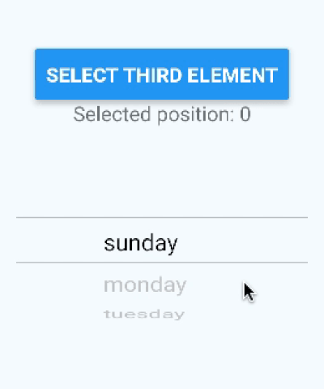
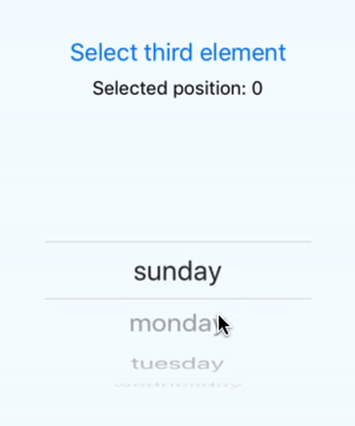

# React Native Picker

A simple Wheel Picker for Android (For IOs is using Picker from react-native-picker/picker)

## Example

You can clone the repo and run example from ./example folder

## Installation

`yarn add @hakanozdemir/react-native-picker`




## Manual Android Installation

In `android/settings.gradle`

```
include ':@hakanozdemir/react-native-picker'
project(':@hakanozdemir/react-native-picker').projectDir = new File(rootProject.projectDir, '../node_modules/@hakanozdemir/react-native-picker/android')
```

In `android/app/build.gradle`

```
dependencies {
    ...
    compile project(':@hakanozdemir/react-native-picker')
}
```

In `android/app/src/main/java/com/PROJECT_NAME/MainApplication.java`

```
@Override
protected List<ReactPackage> getPackages() {
  return Arrays.<ReactPackage>asList(new MainReactPackage(), new WheelPickerPackage());
}
```

# Usage

```js
import { WheelPicker, TimePicker, DatePicker } from '@hakanozdemir/react-native-picker';
import React, { Component } from 'react';
import { AppRegistry, StyleSheet, Text, View, Button } from 'react-native';

const wheelPickerData = [
  'sunday',
  'monday',
  'tuesday',
  'wednesday',
  'thursday',
  'friday'
];

class MyPicker extends Component {
  state = {
    selectedItem: 0
  };

  onItemSelected = selectedItem => {
    this.setState({ selectedItem });
  };

  onPress = () => {
    this.setState({ selectedItem: 3 });
  };

  render() {
    return (
      <View style={styles.container}>
        <Button title={'Select third element'} onPress={this.onPress} />
        <Text>Selected position: {this.state.selectedItem}</Text>
        <WheelPicker
          selectedItem={this.state.selectedItem}
          data={wheelPickerData}
          onItemSelected={this.onItemSelected}
        />
      </View>
    );
  }
}
```

## Props

| Prop                       |   Default   |      Type       | Description                             |
| :------------------------- | :---------: | :-------------: | :-------------------------------------- |
| onItemSelected             |      -      |     `func`      | Returns selected position               |
| data                       |      -      | `Array<string>` | Data array                              |
| isCyclic                   |    false    |     `bool`      | Make Wheel Picker cyclic                |
| selectedItemTextColor      |    black    |    `string`     | Wheel Picker's selected Item text color |
| selectedItemTextSize       |     16      |    `number`     | Wheel Picker's selected Item text size  |
| selectedItemTextFontFamily |      -      |  `font-family`  | Wheel Picker's selected Item font       |
| itemTextColor              |    grey     |    `string`     | Wheel Picker's Item Text Color          |
| itemTextSize               |     16      |    `number`     | Wheel Picker's Item text size           |
| itemTextFontFamily         |      -      |  `font-family`  | Wheel Picker's Item font                |
| selectedItem               |      0      |    `number`     | Current item position                   |
| initPosition               |      0      |    `number`     | Initial item position                   |
| indicatorColor             |    black    |    `string`     | Indicator color                         |
| hideIndicator              |      -      |    `boolean`    | Hide indicator                          |
| indicatorWidth             |      1      |    `number`     | Indicator width                         |
| backgroundColor            | transparent |    `string`     | Wheel Picker background color           |
| disabled                   |  undefind   |     `bool`      | Disable picker selection                |

## Questions or suggestions?

Feel free to [open an issue](https://github.com/ElekenAgency/ReactNativeWheelPicker/issues)
